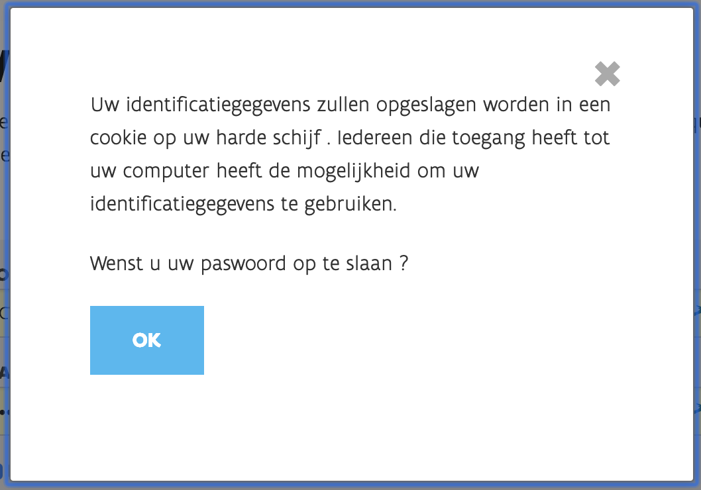
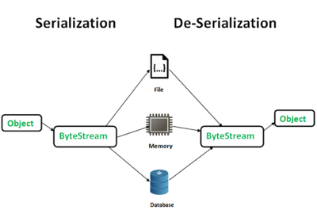

## OWASP

Open Web Application Security Project

---

## OWASP TOP 10

10 top most critical security risks to web applications

make companies aware of risks

improving development culture towards more secure applications

---

## WHY

costs by data breach are bigger than by any other reason

[2017 Cost of Data Breach Study - Ponemon Institute, June 2017](https://www.ibm.com/downloads/cas/ZYKLN2E3)

---

## WHY

* ransom
* lawsuits
* reputation loss
* loss of revenue

---

## PREVENTION CAN BE SIMPLE

mostly it is a state of mind

does not cost much

at least, less than the costs when not taking into consideration

---

## THIS TALK

* explain each topic
* provide a simple solution for mitigation

---

## 01. Injection

### Attack


---

## 01. Injection

### Attack


---

## 01. Injection

### Prevention

* input validation (always check input coming from a user!)
* use parameterized queries
  ```javascript
  const text = 'INSERT INTO users(name, email) VALUES($1, $2) RETURNING *'
  const values = ['brianc', 'brian.m.carlson@gmail.com']

  client.query(text, values, ...)
  ```
* use ORM to query data (Sequelize, ...)

---

## 02. Broken authentication

### Attack

credential stuffing


---

## 02. Broken authentication

### Attack

bad password policy / managment



no 2FA

---

## 02. Broken authentication

### Attack

bad session id managment (easily recoverable or reproducable by attacker)


---

## 02. Broken authentication

### prevention

* rate limiting of consecutive unsuccessful logins
* 2FA
* proper session managment with proven record library (e.g. passport)

---

## 03. Sensitive Data Exposure

### Attack

No or weak SSL/TLS, risk for man in the middle attacks


---

## 03. Sensitive Data Exposure

### Attack

passwords are stored in clear text or weak hash / encryption


---

## 03. Sensitive Data Exposure

### Attack

personal (GDPR) data insecurely stored


---

## 03. Sensitive Data Exposure

### prevention

* force SSL with latest ciphers and hashing (infrastructure)
* use pasword hashing with latest proven libraries
* for sensitive data: properly design application

---

## 04. XML External Entities

### Attack


---

## 04. XML External Entities

### Attack


---

## 04. XML External Entities

### prevention

* don't use XML :) (JSON, yaml, protobuf)
* OWASP Cheat sheet 'XXE prevention'

---

## 05. Broken Access Control

### Attack

user can access resources by changing the url or parameters without validation

---

## 05. Broken Access Control

### prevention

* always check users' permissions server side
* principle of least privilege
* log unauthorized access
* rate limit access

---

## 06. Security Misconfiguration

### attack

unwanted applications / functionalities are available and unprotected

standard accounts are still enabled

exceptions are shown to the user exposing detailed information of the used components

---

## 06. Security Misconfiguration

### prevention

always use latest patch of all applications / libraries

be aware of what is enabled / accessible to the user

take care of what you disclose to the user (application versions / exception messages)

perform a security check

---

## 07. Cross-Site Scripting (XSS)

### attack


---

## 07. Cross-Site Scripting (XSS)

### prevention

* React already has some XSS preventions
* but not everything is covered


---

## 08. Insecure Deserialization

### attack



Besides data, also code can be deserialized, forcing the server to execute unwanted code

---

## 08. Insecure Deserialization

### prevention

* only accept serialized data from trusted sources
* only deserialization to primitive types (integers, strings, dates) (JSON...)

---

## 09. Using Components with Known Vulnerabilities

### attack

many known flaws of used applications / libraries are not patched

automated scanners can detect this very quickly

---

## 09. Using Components with Known Vulnerabilities

### prevention

* remove unused dependencies
* be informed of latest vulnerabilities and patch accordingly
* beware of unmaintained applications / libraries

---

## 10. Insufficient Logging&Monitoring

### not really an attack

but in case of an attack, no sufficient logging / monitoring is in place to detect it

---

## 10. Insufficient Logging&Monitoring

### prevention

* provide extensive and secure logging
* centralise logging
* monitor the logging

---

## summary

* developer awareness
  * understand risks (no silver bullet solution)
  * include in "definition of done"
  * "know what you use"
  * keep taps on used libraries and applications
* infrastructure
  * rate limit access
  * close unused ports / SSL only
* architecture
  * sensible data: who's allowed to use it?

---

## What's next?

This top 10 list is certainly not the end.

* CWE: common weakness enumeration
* CAPEC: common attack pattern enumeration and classification

---

## one more thing

### nodejs packages

nodejs packages are very fragmented

dependency tree is very large


